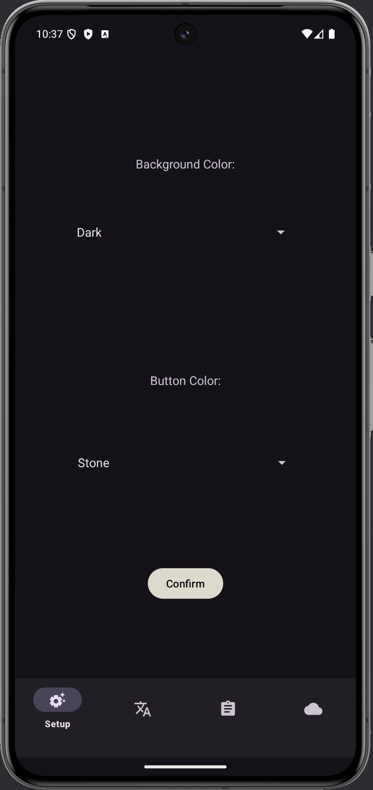
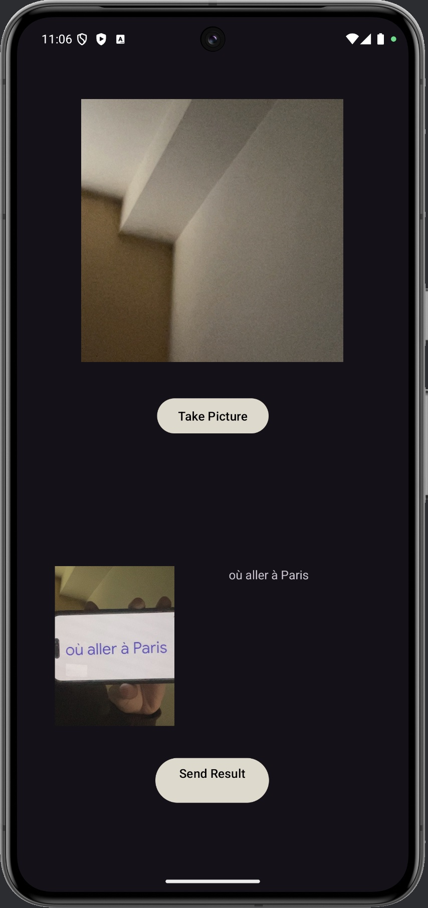
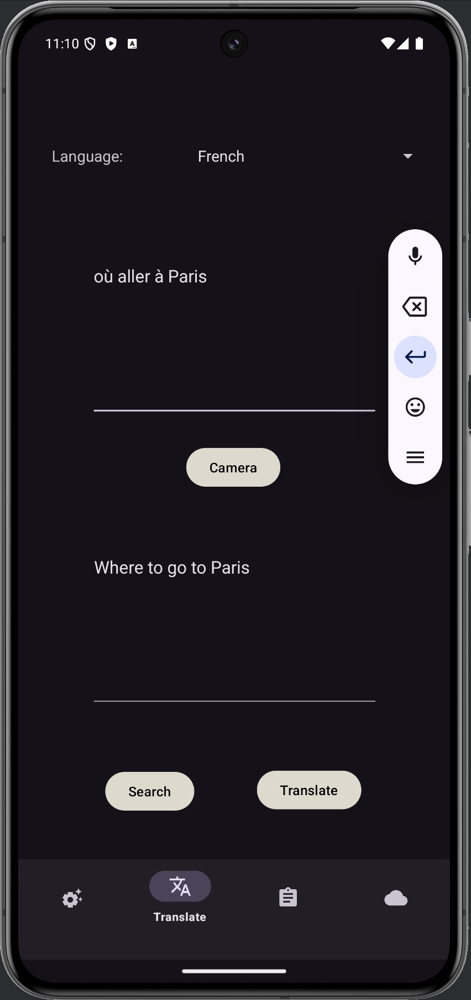
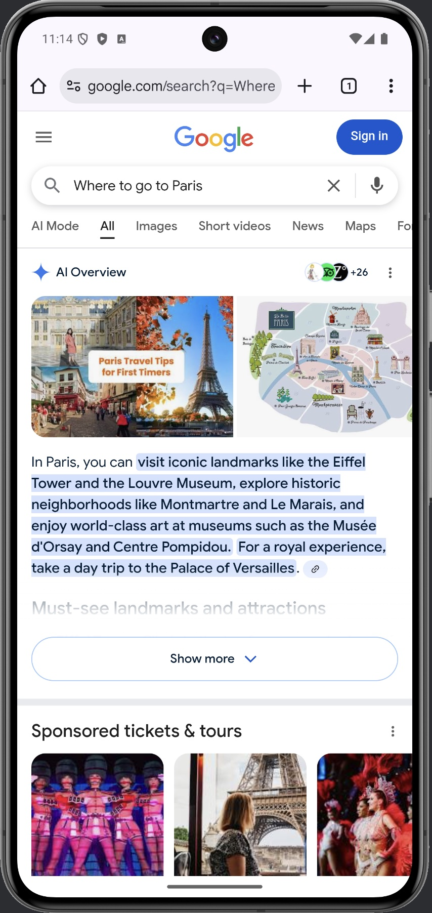
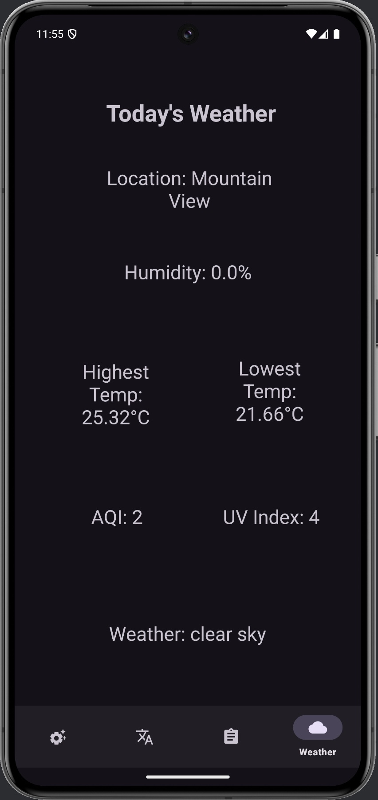
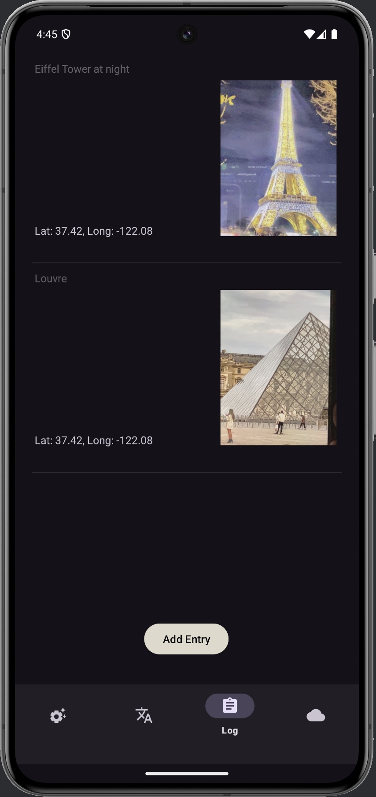

# 🌍 Travel Pal  
_A collaborative Android app that assists travelers with instant translation, live weather updates, a travel log, and text-on-image recognition with translation._


## 🗺 Overview
**Travel Pal** is your on-the-go travel assistant designed for tourists, students, and adventurers.  
The app combines translation, weather forecasting, journaling, and OCR technology to make traveling in foreign countries effortless.

Whether you're reading a menu, navigating a city, or documenting your trip, Travel Pal helps you stay connected, informed, and organized — all in one Android app.

## ✨ Features
- 🈯 **Instant Translation** — Translate text between multiple languages in real time.  
- ☀️ **Weather Updates** — Check weather conditions for your current or selected destination.  
- 📓 **Travel Log** — Record trips, notes, and memories with date and location tracking.  
- 📷 **Text-on-Image Recognition** — Capture and translate text from signs, menus, or documents using the camera.  
- 💾 **Offline Storage** — Save translations and logs locally using Room Database.  
- 🧭 **Simple Interface** — Built with intuitive navigation and modern Android UI design.

## 📸 Screenshots
<div align="center">

<table>
  <tr>
    <td align="center"><b>Setup</b></td>
    <td align="center"><b>Camera (OCR)</b></td>
    <td align="center"><b>Translation</b></td>
    <td align="center"><b>Web Search</b></td>
    <td align="center"><b>Weather</b></td>
    <td align="center"><b>Travel Log</b></td>
  </tr>
  <tr>
    <td></td>
    <td></td>
    <td></td>
    <td></td>
    <td></td>
    <td></td>
  </tr>
</table>

</div>

## 🧱 Architecture & Technologies
| Layer | Description |
|-------|--------------|
| **Language** | Java 17 |
| **Architecture** | MVVM-style pattern with Room DAO components |
| **Database** | Room Database v2.6.1 |
| **UI** | ViewBinding enabled |
| **Android SDK** | minSdk 34 · targetSdk 34 |
| **Build Tool** | Gradle 8+ |
| **IDE** | Android Studio Koala Feature Drop (2024.1.2 Patch 1) |
| **Tested on** | Pixel 8 Pro Emulator (API 35, Android 15) |
| **External APIs** | Translation API (coming soon), Weather API (uses REST calls via HTTP) |

## ⚙️ Installation & Setup
To run **Travel Pal** locally:

1. **Clone the repository**
   ```bash
   git clone https://github.com/<your-username>/travel-pal.git
   cd TravelPal
   ```
2. **Open in Android Studio**
   - Version: *Koala Feature Drop 2024.1.2 Patch 1*
   - JDK: *17.0.11+0-17.0.11b1207.24-11852314 aarch64*

3. **Build the project**
   - Wait for Gradle sync to finish.
   - Select your emulator (recommended: Pixel 8 Pro API 35).

4. **Run the app**
   - Click ▶️ to build and launch.
   - Grant camera and location permissions on first run.

5. *(Optional)* Add your own API keys in  
   `app/src/main/res/values/keys.xml` for weather services.

## 🧭 Usage

1. **Translation Tab** — Type or paste text → choose target language → view instant translation.  
2. **Camera Tab** — Capture image → automatic OCR text detection → translated result displayed.  
3. **Weather Tab** — View local or destination weather forecast.  
4. **Log Book Tab** — Add entries with date, notes, and optional photo.  
5. **Saved Entries** — Access all previous logs and translations offline.

## 🤝 Contributing
This is a university-affiliated personal project for educational and portfolio purposes.  
Feel free to fork the repository, open issues, or suggest improvements.

## 📄 License
Distributed under the **MIT License**.  
See [`LICENSE`](LICENSE) for full text.

## 👩‍💻 Authors
**Anna Tymoshenko, Michelle Duong, Triston Scott**  
Computer Science Department — Pacific University
📍 Forest Grove, Oregon, USA

🔗 [Anna](https://github.com/annat7m)
🔗 [Michelle](https://github.com/michelleduong03)
🔗 [Triston](https://github.com/scot5781)

## 🙏 Acknowledgements
- [Android Developers Documentation](https://developer.android.com/docs)
- [Room Database Guide](https://developer.android.com/training/data-storage/room)
- [OpenWeather API](https://openweathermap.org/api)
- [Google ML Kit for Text Recognition](https://developers.google.com/ml-kit/vision/text-recognition)
- [Material Design Icons](https://material.io/resources/icons)
